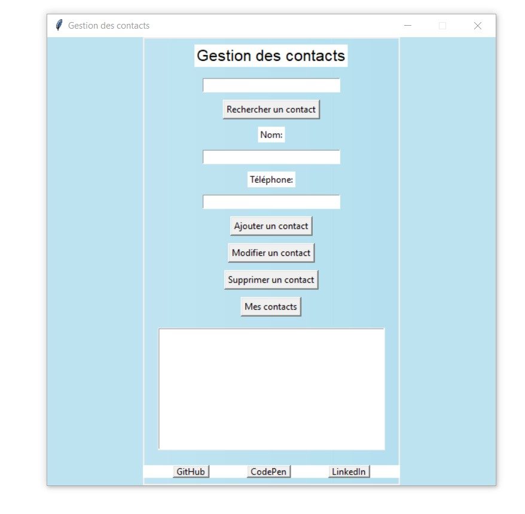

# Gestionnaire de Contacts avec Interface Graphique

Une application en Python permettant de gérer facilement des contacts grâce à une interface graphique réalisée avec Tkinter. Les contacts sont stockés dans un fichier JSON, offrant ainsi une solution simple et rapide pour ajouter, rechercher, modifier, supprimer et lister des contacts.

## Fonctionnalités

- **Ajouter un contact** : Ajouter un nouveau contact avec un nom et un numéro de téléphone.
- **Rechercher un contact** : Rechercher un contact existant par son nom.
- **Modifier un contact** : Modifier les informations d'un contact existant.
- **Supprimer un contact** : Supprimer un contact de la liste.
- **Lister tous les contacts** : Afficher tous les contacts stockés.

## Prérequis

Avant de commencer, assurez-vous que les éléments suivants sont installés :

- **Python 3.x**
- **Bibliothèques requises** :
  - `requests` : pour télécharger des images depuis une URL.
  - `Pillow` : pour manipuler et afficher des images.

## Installation

1. Clonez le dépôt sur votre machine locale :

    ```bash
    git clone https://github.com/Monsieur9Bre99/contact_manager.git
    cd contact_manager
    ```

2. Pour installer les dépendances nécessaires :

    ```bash
    pip install requests pillow
    ```

3. Lancez l'application :

    ```bash
    python main.py
    ```

## Structure du Projet

Le projet est organisé de manière modulaire pour faciliter sa maintenance et son extension.


| Fichier              | Description                                                                                   |
|----------------------|-----------------------------------------------------------------------------------------------|
| `main.py`            | Lance l'interface graphique de l'application                                                  |
| `contact_gui.py`     | Contient la classe `ContactGui` qui gère l'interface graphique                                |
| `contact_manager.py` | Contient les fonctions pour gérer les contacts (ajout, recherche, modification, suppression, liste) |
| `contacts.json`      | Fichier JSON où les contacts sont stockés                                                     |

## Exemple du fichier contacts.json 

```bash
[
    {
        "name": "Jones",
        "phone": "0600001000"
    },
    {
        "name": "Quincy",
        "phone": "0700001000"
    }
]
```

## Capture d'écran




## Contributions 

Les contributions sont les bienvenues ! Pour contribuer, suivez les étapes suivantes : 
- Forkez ce dépôt.
- Créez une branche pour votre fonctionnalité, amélioration ou correction de bug :

```bash 
    git checkout -b feature/nom-de-la-fonctionnalité
```
- Commitez vos modifications  & Poussez Votre branche
```bash 
    git commit -am 'Ajout de la fonctionnalité'
```
---

```bash 
    git push origin feature/nom-de-la-fonctionnalité
```

## Auteur
 &copy; 2024 BREROOT
